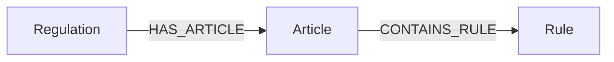
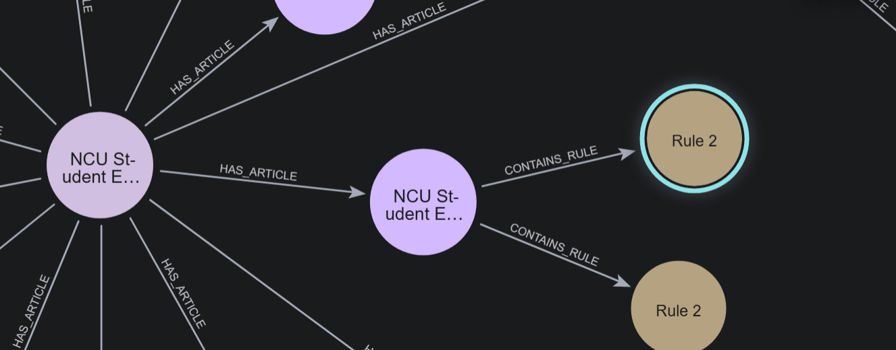

# Assignment 4

## KG construction logic and design choices

### 1. 資料來源

圖譜的原始資料來自 SQLite 資料庫 `ncu_regulations.db`，其中包含：

- `regulations(reg_id, name, category)`：法規基本資訊
- `articles(reg_id, article_number, content)`：法條內容

### 2. 圖譜 schema

專案固定使用以下圖譜結構：

實際節點與關係如下：

- `Regulation`
	- `id`, `name`, `category`
- `Article`
	- `number`, `content`, `reg_name`, `category`
- `Rule`
	- `rule_id`, `type`, `action`, `result`, `art_ref`, `reg_name`

關係：

- `(Regulation)-[:HAS_ARTICLE]->(Article)`
- `(Article)-[:CONTAINS_RULE]->(Rule)`

### 3. Rule 抽取策略

`build_kg.py` 會對每條 Article 做兩段式抽取：

1. **LLM 抽取**：讓模型從條文中整理出規則，並輸出結構化 JSON。
2. **Fallback 規則抽取**：如果 LLM 抽取不足，則用簡單且可重現的關鍵字規則補足。

### 4. Rule 設計

- **Rule type 正規化**：將抽取結果統一為 `Prohibition`、`Obligation`、`Requirement`、`Permissions`、`Incentive Rules`，方便檢索系統匹配類型。
- **去重**：用 `(action, result)` 去除重複和無用的規則。
- **全文索引**：對 Article content 與 Rule action/result 建全文索引，提升查詢覆蓋率。

---

## KG Schema / Diagram

---

## Key Cypher Query Design and Retrieval Strategy

### 1. 問題解析：先把自然語句轉成檢索屬性

- `question_type`：問題類型，例如費用、條件、流程、權限等
- `rule_types`：對應的規則型別，例如 `Prohibition`、`Requirement`
- `subject_terms`：主題詞，例如學生證、學分、考試
- `keywords`：用來做全文檢索的關鍵字

### 2. 兩層檢索主體

目前查詢採用兩層主體策略：

#### A. Typed Query

先用較精準的條件找規則：

- 規則型別 `r.type`
- `r.action` / `r.result` 中是否包含關鍵詞

這層的目的是優先找到語意最接近的規則。

#### B. Broad Query

如果 typed query 結果不足，再用全文索引 `rule_idx` 搜尋：

- 將 `keywords + subject_terms` 合併
- 對 `Rule.action` 與 `Rule.result` 做 fulltext search

### 3. 回答不足時的補救

若 Rule 層結果仍不夠，系統會進一步利用 `article_content_idx` 搜尋 Article 原文，作為最後 fallback。

先找到最接近原始條文的上下文，再讓 LLM 根據證據作答。

### 4. 結果排序與合併

檢索後會：

- 依 `rule_id` 去重
- 依相關度排序
- 保留 `art_ref`、`reg_name`、`article_content` 供答案生成引用

---

## 專案檔案說明

- `setup_data.py`：將 PDF 規章整理成 SQLite。
- `build_kg.py`：把 SQLite 資料建成 Neo4j 圖譜。
- `query_system.py`：問題解析、圖譜檢索、答案生成。
- `auto_test.py`：自動測試系統表現。
- `result.txt`：最佳測試結果 12/8 (60% 通過率)

---

## Failure analysis + improvements made

本次測試中發現，即使是相同的生成策略與檢索系統，LLM每次測試的結果也都有所不同，有2到3題的浮動。
我發現修改LLM對問題的類型與關鍵字提取能改善情況，因為很多時候是LLM提取到不是那麼相關的關鍵字，導致抓到的Node較雜且無效，影響答案的推斷。

